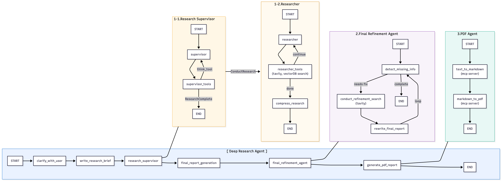

# AI-Master-Project – Deep Research 실행 가이드

## 전체 구성도



## 프로젝트 구조

```
AI-Master-Project---Deep-Research/
├── chunking/                    # 청킹 모듈
│   ├── add_metadata.py
│   ├── chunker.py
│   └── output/                  
├── data/                        # 원본 PDF 데이터
├── embedding/                   # 임베딩 결과물
├── odr/                         
│   ├── chroma_db/               # ChromaDB 벡터 데이터베이스
│   ├── examples/                
│   ├── outputs/                 # 임베딩 결과
│   ├── src/
│   │   ├── legacy/              
│   │   ├── open_deep_research/  # 메인 연구 모듈
│   │   │   ├── deep_researcher.py
│   │   │   ├── final_refinement_agent.py # Final Refinement Agent
│   │   │   ├── outputagent/     # PDF Agent
│   │   │   │   └── mcpserver.py
│   │   │   └── vectordb_search.py
│   │   └── security/            
│   ├── tests/                   # 테스트 코드 (tavily, VectorDB 비교 테스트)
│   ├── langgraph.json
│   └── pyproject.toml
├── parsing/                     # 파싱 모듈
│   ├── vlm_parser.py
│   └── output/                  
├── vectordb/                    # ChromaDB 벡터 데이터베이스 & 임베딩
│   ├── chroma_db_addmeta/       
│   ├── chroma_db_test1/         
│   ├── chroma_db_test2/         
│   ├── outputs/                 
│   ├── config.yml
│   ├── dbchecker.py
│   ├── embedding.py
│   ├── main.py
│   └── vectordb_chroma.py
├── LICENSE
├── README.md
└── requirements.txt
```

## 설치 및 실행

1) 가상환경 세팅

```
cd ODR_w_RAG
uv venv
source .venv/bin/activate
```


2) 가상 환경 설치
```
uv sync
```

3) Mac 기준 필수 패키지
```
brew install pandoc
brew install --cask mactex
```

4) env 파일 복사 후 key 값 입력
```
cp .env.example .env
```

## ----- MCP Servers 실행  -----

### PDF Agent MCP Server

```
cd src/open_deep_research/outputagent/
python mcpserver.py
```

 → Uvicorn running on http://0.0.0.0:8001 확인

## ----- Open Deep Research (LangGraph Studio) 실행 -----

```
cd odr
```

랭그래프 스튜디오 실행 명령어 

```
uvx --refresh --from "langgraph-cli[inmem]" \
  --with-editable . \
  --python 3.11 \
  langgraph dev --allow-blocking
```

## ----- LangGraph Studio 수동 설정 -----
 Manage Assistants 에서 다음 설정 수행
 - SearchAPI : None 또는 tavily
 - Enable Vectordb Search : ON
 - 저장 경로 (절대경로 필수)
   * md output path
   * pdf output path
